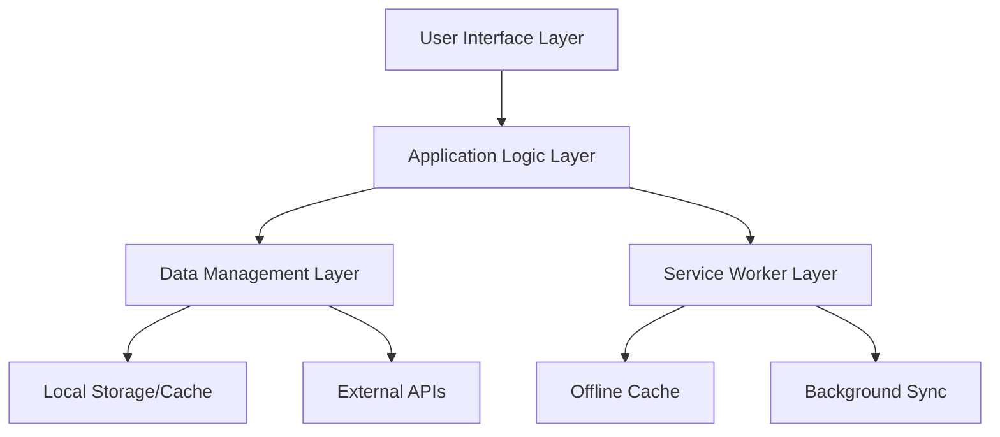

# Design Document: HealthDesk Platform

## Overview

HealthDesk is a Next.js-based Progressive Web Application (PWA) designed to serve as a personal AI medical interpreter. The platform prioritizes accessibility, offline functionality, and simplified medical information delivery for rural users, elders, and caregivers. The architecture emphasizes reliability, trust, and ease of use while maintaining compliance with healthcare accessibility standards.

## Architecture

### High-Level Architecture



### Technology Stack

- **Frontend Framework**: Next.js 14 with Pages Router
- **Language**: JavaScript (ES6+) with JSX
- **Styling**: Tailwind CSS for responsive, accessible design
- **PWA Features**: Custom Service Worker for offline capabilities
- **State Management**: React Context API for global state
- **Storage**: Browser LocalStorage and IndexedDB for offline data
- **Accessibility**: WCAG 2.1 AA compliance implementation

### Deployment Architecture

- **Hosting**: Static deployment optimized for CDN distribution
- **Caching Strategy**: Multi-layer caching (CDN, Service Worker, Browser)
- **Performance**: Code splitting and lazy loading for optimal load times

## Components and Interfaces

### Core Components

#### 1. Layout Components
- **MainLayout**: Primary application wrapper with navigation and accessibility features
- **Navigation**: Accessible navigation with keyboard support and screen reader compatibility
- **Header**: Platform branding with emergency access button
- **Footer**: Contact information and accessibility links

#### 2. Medical Information Components
- **MedicalInterpreter**: Processes and simplifies complex medical information
- **ReportProcessor**: Handles medical report upload, analysis, and interpretation
- **EmergencyModule**: Provides SOS functionality and emergency guidance
- **MedicineTracker**: Manages medication information and availability

#### 3. User Interface Components
- **ConsultationInterface**: Structured symptom documentation and appointment preparation
- **OfflineIndicator**: Shows connectivity status and offline capabilities
- **AccessibilityControls**: Font size, contrast, and audio controls
- **ProgressIndicator**: Visual feedback for processing operations

### Component Interfaces

#### MedicalInterpreter Interface
```javascript
// Input: Complex medical text or data
// Output: Simplified, structured medical information
{
  simplifyMedicalText: (complexText) => simplifiedContent,
  highlightKeyTerms: (content) => annotatedContent,
  categorizeByUrgency: (information) => prioritizedSections
}
```

#### ReportProcessor Interface
```javascript
// Input: Medical report file or text
// Output: Visual and audio interpretation
{
  processReport: (reportFile) => analysisResult,
  generateVisualSummary: (analysis) => visualComponents,
  createAudioExplanation: (analysis) => audioContent
}
```

#### EmergencyModule Interface
```javascript
// Input: Emergency type or user trigger
// Output: Guidance steps and contact information
{
  activateSOS: (location, medicalInfo) => emergencyResponse,
  getEmergencyGuidance: (situation) => stepByStepInstructions,
  getLocalContacts: (location) => emergencyServices
}
```

## Data Models

### User Profile Model
```javascript
{
  id: string,
  preferences: {
    fontSize: 'small' | 'medium' | 'large',
    highContrast: boolean,
    audioEnabled: boolean,
    language: string
  },
  medicalInfo: {
    conditions: string[],
    medications: string[],
    allergies: string[],
    emergencyContacts: Contact[]
  },
  consultationHistory: Consultation[]
}
```

### Medical Report Model
```javascript
{
  id: string,
  uploadDate: Date,
  originalFile: File,
  processedContent: {
    keyFindings: string[],
    abnormalValues: LabValue[],
    recommendations: string[],
    urgencyLevel: 'low' | 'medium' | 'high' | 'critical'
  },
  audioSummary: AudioFile,
  visualSummary: VisualElement[]
}
```

### Consultation Model
```javascript
{
  id: string,
  date: Date,
  symptoms: string[],
  questions: string[],
  notes: string,
  followUpReminders: Reminder[],
  medicationChanges: MedicationUpdate[]
}
```

### Medicine Information Model
```javascript
{
  id: string,
  name: string,
  genericName: string,
  description: string,
  dosage: string,
  sideEffects: string[],
  interactions: string[],
  localAvailability: PharmacyInfo[],
  urgencyLevel: 'routine' | 'important' | 'critical'
}
```

## Correctness Properties

*A property is a characteristic or behavior that should hold true across all valid executions of a system—essentially, a formal statement about what the system should do. Properties serve as the bridge between human-readable specifications and machine-verifiable correctness guarantees.*

Based on the prework analysis, here are the testable correctness properties:

### Property 1: Responsive Interface Consistency
*For any* viewport size within the supported range (320px to 1920px width), the HealthDesk platform interface should remain functional with all interactive elements accessible and properly sized.
**Validates: Requirements 1.1**

### Property 2: Accessibility Compliance
*For any* interactive element in the platform, it should have proper ARIA labels, meet WCAG 2.1 color contrast requirements, and be navigable via keyboard.
**Validates: Requirements 1.3**

### Property 3: User Interaction Feedback
*For any* clickable element, interacting with it should provide immediate visual feedback and maintain consistent navigation patterns.
**Validates: Requirements 1.4**

### Property 4: Medical Text Simplification
*For any* complex medical text input, the Medical_Interpreter should output text with measurably lower complexity scores while preserving essential medical meaning.
**Validates: Requirements 2.1**

### Property 5: Medical Term Annotation
*For any* medical text processed by the system, all identified medical terms should have associated plain-language explanations.
**Validates: Requirements 2.2**

### Property 6: Medical Information Organization
*For any* medical advice content, the output should be organized into clearly defined sections with appropriate priority ordering.
**Validates: Requirements 2.3**

### Property 7: Urgency Level Indicators
*For any* medical information processed, urgency levels should be consistently applied and visually distinguishable.
**Validates: Requirements 2.4**

### Property 8: Offline Caching Behavior
*For any* essential medical information, when connectivity becomes limited, the content should be available in local storage for offline access.
**Validates: Requirements 3.1**

### Property 9: Connectivity Status Detection
*For any* change in network connectivity status, the platform should correctly detect and display the current connectivity state to users.
**Validates: Requirements 3.2**

### Property 10: Offline Content Access
*For any* cached medical content, it should remain accessible and functional when the platform operates in offline mode.
**Validates: Requirements 3.3**

### Property 11: Cache Synchronization
*For any* cached content, when connectivity is restored, the local cache should synchronize with updated information from the server.
**Validates: Requirements 3.4**

### Property 12: Emergency Guidance Structure
*For any* emergency situation identified, the Emergency_Module should provide structured, step-by-step guidance with clear action items.
**Validates: Requirements 4.2**

### Property 13: SOS Information Sharing
*For any* SOS activation, available location and medical information should be properly formatted and shared according to emergency protocols.
**Validates: Requirements 4.4**

### Property 14: Medical Report Analysis
*For any* uploaded medical report, the Report_Processor should extract and structure key information including findings, values, and recommendations.
**Validates: Requirements 5.1**

### Property 15: Visual Summary Generation
*For any* processed medical report, visual summaries should contain all essential elements including key findings and abnormal values.
**Validates: Requirements 5.2**

### Property 16: Audio Explanation Availability
*For any* medical report when audio capabilities are available, spoken explanations should be generated and accessible to users.
**Validates: Requirements 5.3**

### Property 17: Abnormal Value Highlighting
*For any* medical report with abnormal values, these values should be highlighted with appropriate medical context and urgency indicators.
**Validates: Requirements 5.4**

### Property 18: Consultation Organization
*For any* consultation preparation, questions and medical history should be structured and organized in a logical, accessible format.
**Validates: Requirements 6.2**

### Property 19: Secure Data Storage
*For any* consultation notes and recommendations, the data should be encrypted and stored securely in compliance with healthcare privacy standards.
**Validates: Requirements 6.3**

### Property 20: Reminder System Functionality
*For any* scheduled appointment or medication, appropriate reminders should be created and triggered at the specified times.
**Validates: Requirements 6.4**

### Property 21: Medicine Information Completeness
*For any* medicine search query, results should include comprehensive details about usage, side effects, and interactions when available.
**Validates: Requirements 7.1**

### Property 22: Pharmacy Availability Display
*For any* medicine with available pharmacy data, local availability information should be displayed to users.
**Validates: Requirements 7.2**

### Property 23: Medication Conflict Detection
*For any* combination of medications, conflicts should be identified and alternative suggestions provided when interactions are detected.
**Validates: Requirements 7.3**

### Property 24: Medication Tracking Consistency
*For any* medication reminder or dosage tracking entry, the system should maintain accurate records and provide timely notifications.
**Validates: Requirements 7.4**

<function_calls>
<invoke name="prework">
<parameter name="featureName">health-desk-platform

## Error Handling

### Error Categories and Responses

#### 1. Network and Connectivity Errors
- **Offline Mode Activation**: Gracefully transition to cached content when network is unavailable
- **Partial Connectivity**: Implement retry mechanisms with exponential backoff
- **API Failures**: Provide meaningful error messages and fallback options
- **Timeout Handling**: Set appropriate timeouts for medical data requests

#### 2. User Input Validation Errors
- **Medical Report Upload**: Validate file types, sizes, and formats before processing
- **Form Validation**: Provide real-time validation with clear, accessible error messages
- **Data Sanitization**: Ensure all user inputs are properly sanitized for security
- **Required Field Validation**: Guide users to complete necessary information

#### 3. Medical Data Processing Errors
- **Report Analysis Failures**: Provide partial results when full analysis fails
- **Text Simplification Errors**: Fall back to original text with warnings
- **Audio Generation Failures**: Offer alternative text-based explanations
- **Cache Corruption**: Implement cache validation and recovery mechanisms

#### 4. Emergency System Errors
- **Location Services Unavailable**: Provide manual location entry options
- **SOS Communication Failures**: Offer alternative emergency contact methods
- **Emergency Contact Validation**: Verify contact information accessibility

#### 5. Accessibility and User Experience Errors
- **Screen Reader Compatibility**: Ensure all error messages are accessible
- **High Contrast Mode Issues**: Maintain error visibility in all display modes
- **Keyboard Navigation Failures**: Provide alternative navigation paths
- **Font Size Scaling Problems**: Ensure error messages scale appropriately

### Error Recovery Strategies

#### Graceful Degradation
- Maintain core functionality even when advanced features fail
- Provide simplified alternatives when complex processing fails
- Ensure emergency features remain available during system errors

#### User Communication
- Use plain language for all error messages
- Provide actionable steps for error resolution
- Maintain calm, reassuring tone appropriate for healthcare context
- Offer multiple ways to contact support or get help

#### Data Integrity Protection
- Implement transaction rollback for failed operations
- Maintain data consistency during error conditions
- Provide data recovery options when possible
- Log errors for system improvement without compromising privacy

## Testing Strategy

### Dual Testing Approach

The HealthDesk platform will implement both unit testing and property-based testing to ensure comprehensive coverage and reliability:

#### Unit Testing
Unit tests will focus on:
- **Specific Examples**: Test concrete scenarios like loading the emergency contact page
- **Edge Cases**: Test boundary conditions such as maximum file upload sizes
- **Error Conditions**: Test specific error scenarios like invalid medical report formats
- **Integration Points**: Test component interactions and API integrations
- **Accessibility Features**: Test specific WCAG compliance scenarios

#### Property-Based Testing
Property tests will verify universal behaviors across all inputs:
- **Universal Properties**: Test behaviors that should hold for all valid inputs
- **Comprehensive Input Coverage**: Use randomized testing to cover edge cases
- **Correctness Validation**: Verify that each correctness property holds across many test cases

### Testing Framework Configuration

#### Property-Based Testing Setup
- **Framework**: Use `fast-check` library for JavaScript property-based testing
- **Test Iterations**: Minimum 100 iterations per property test to ensure thorough coverage
- **Test Tagging**: Each property test must reference its corresponding design property
- **Tag Format**: `**Feature: health-desk-platform, Property {number}: {property_text}**`

#### Unit Testing Setup
- **Framework**: Jest with React Testing Library for component testing
- **Coverage Requirements**: Minimum 80% code coverage for critical healthcare features
- **Accessibility Testing**: Integration with `@testing-library/jest-dom` and `axe-core`
- **Mock Strategy**: Minimal mocking to test real functionality, especially for medical data processing

### Test Categories and Priorities

#### Critical Path Testing (Priority 1)
- Emergency SOS functionality
- Medical report processing accuracy
- Offline mode operation
- Accessibility compliance
- Data security and privacy

#### Core Feature Testing (Priority 2)
- Medical information simplification
- User interface responsiveness
- Consultation documentation
- Medicine tracking and reminders
- Cache synchronization

#### Enhancement Testing (Priority 3)
- Audio explanation generation
- Advanced search functionality
- Performance optimization features
- Extended offline capabilities

### Continuous Testing Strategy

#### Automated Testing Pipeline
- Run all tests on every code commit
- Property-based tests with randomized seeds for comprehensive coverage
- Accessibility testing integrated into CI/CD pipeline
- Performance testing for critical user journeys

#### Manual Testing Requirements
- Usability testing with target demographics (rural users, elders)
- Accessibility testing with assistive technologies
- Emergency scenario testing with healthcare professionals
- Cross-device and cross-browser compatibility testing

### Test Data Management

#### Medical Data Testing
- Use anonymized, synthetic medical data for testing
- Ensure test data covers diverse medical scenarios
- Maintain HIPAA compliance in all test environments
- Regular updates to test data to reflect current medical practices

#### User Scenario Testing
- Create personas representing target user groups
- Test scenarios covering various healthcare situations
- Include emergency and high-stress situation testing
- Validate multilingual and accessibility requirements

This comprehensive testing strategy ensures that HealthDesk maintains the highest standards of reliability, accessibility, and user safety required for a healthcare platform.